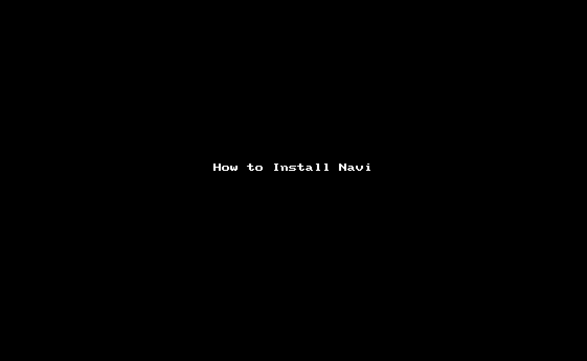
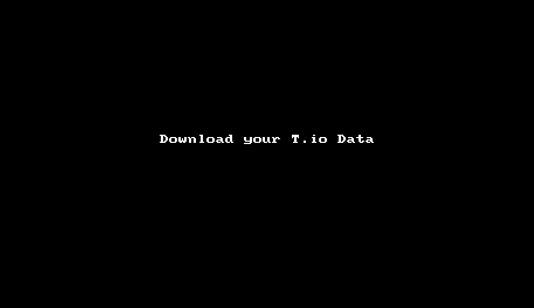

# Navi Pro - The Tenable.io Swiss Army Knife
A command-line tool which leverages the Tenable.io API to reduce the time it takes to get information that is common 
in Cyber Exposure or Vulnerability Management.

### Important Note
Navi Pro will download the entire data-set locally after API keys are 
entered and commands are run! To download Vuln and Asset data you have to be an Administrator.

All Vulns and All Assets are downloaded into two txt files in json format:
 **tio_asset_data.txt** and **tio_vuln_data.txt**.  
 
 Most of the API calls nessessary to make Navi work require access to
 your all of the available data.  Tenable.io has a 5000 record limit so Navi_pro.py utilizes the Export API.
 
 The data will not be updated until you run the update command.
 
 `python3 Navi_pro.py update`

## General Instructions
  * Download Navi_pro.py to your machine
  * Install the required packages
  * Enter in your API keys  :`python3 Navi_pro.py keys`
  
## Download and Configure Navi

    `docker pull silentninja/navi_pro`
  
    `docker run -it silentninja/navi_pro:latest /bin/bash `

    `Navi_pro.py keys`
    
   

     `Navi_pro.py update
  
## Detach from Container
  * CTR+Q+P
## Attach to Contianer
  `docker attach <container id>`
  
  `<press enter>`
  
## Usage
Before you begin you need the Keys! The program will continue to error out without valid API keys

`python3 Navi_pro.py keys`

Each command has two parts: the Command and the Option/Request. Double-Dash(--), commands expect a text value. Single-Dash commands do not have an expected input.  

There are nine core commands: 
 * api - query api endpoints
 * ip - find details on Specific IPs
 * find - Find information: credential failures, containers, etc
 * report - Report on Information: Latest scan information, Container vulns
 * list - List details: users, logs, etc
 * group - Create Target groups based off of Plugin ID, Plugin Name or Plugin Output
 * export - Export Agent or Asset data into a CSV
 * delete - Delete an object by it's ID
 * mail - Mail a report 
 
 There are ten single use commands: 
 * scan - Create and lanuch a scan
 * start - Start a scan by Scan-ID
 * pause - Pause a scan by Scan-ID
 * resume - Resume a scan by Scan-ID
 * stop - Stop a scan by Scan-ID
 * spider - Create a WebApp scan for every URL in a CSV
 * update - Update local Export Vuln and Asset data.
 * delete - Delete a scan by Scan ID
 * status - Get the latest status by Scan ID
 * mac - Get the manufacture by Mac Address
 

### Explore the Tenable.io API - 'api'
  Enter in a API endpoint and get a pretty print json ouput.  Try some of the below endpoints:
   * /scans
   * /scanners
   * /users

### Examples

`python3 Navi_pro.py api /scans`

`python3 Navi_pro.py api /scanners`
  
### IP address queries - 'ip'
  * --plugin TEXT --> Find Details on a particular plugin ID
  * -n --> Netstat Established and Listening and Open Ports
  * -p --> Patch Information
  * -t --> Trace Route
  * -o --> Process Information
  * -c --> Connection Information
  * -s --> Services Running
  * -r --> Local Firewall Rules
  * -d --> Scan Detail: 19506 plugin output
  * -patches --> Missing Patches
  * -software --> Find software installed on Unix of windows hosts
  * -outbound --> outbound connections found by nnm
  * -exploit --> Display exploitable vulnerabilities
  * -critical --> Display critical vulnerabilities
  * -details --> Details on an Asset: IP, UUID, Vulns, etc

### Examples

`python3 Navi_pro.py ip 192.168.1.1 --plugin 19506`

`python3 Navi_pro.py ip 192.168.1.1 -details -software`

### Find information - 'find'
  * --plugin TEXT --> Find Assets where this plugin fired
  * -docker --> Find Running Docker Containers
  * -webapp --> Find Web Servers running
  * -creds  --> Find Credential failures
  * --time TEXT --> Find Assets where the scan duration is over X mins
  * -ghost --> Find Assets found by a Connector and not scanned by Nessus(AWS ONLY)

### Examples
`python3 Navi_pro.py find --plugin 19506`

`python3 Navi_pro.py find -docker`

`python3 Navi_pro.py find --time 10`

### Reports - Information - 'report'
  * -latest -->  Report the Last Scan Details
  * --container TEXT --> Report Vulns of CVSS 7 or above by Container ID.
  * --docker TEXT --> Report Vulns of CVSS 7 or above by Docker ID
  * --comply TEXT --> Check to see if your container complies with your Policy
  * --details TEXT --> Report Scan Details including Vulnerability Counts by Scan ID
  * --summary TEXT --> Report Scan Summary by Scan ID

### Examples
`python3 Navi_pro.py report -latest`

`python3 Navi_pro.py report --container 48b5124b2768`

`python3 Navi_pro.py report --docker 48b5124b2768`

`python3 Navi_pro.py report -comply 48b5124b2768`

`pyton3 Navi_pro.py report --summary 13`

### List - Common Information - 'list'
  * -scanners --> List all of the Scanners
  * -users --> List all of the Users
  * -exclusions --> List all Exclusions
  * -containers --> List all containers and their Vulnerability  Scores
  * -logs --> List The actor and the action in the log file
  * -running --> List the running Scans
  * -scans --> List all Scans
  * -nnm --> Nessus Network Monitor assets and their vulnerability scores
  * -assets --> Assets found in the last 30 days
  * -policies --> Scan Policies
  * -connectors --> Displays information about the Connectors
  * -agroup --> Displays information about Access Groups
  * -status --> Displays Tenable.io License and Site information
  * -agents --> Displays information on Agents
  * -webapp --> Displays information on Web app Scans
  * -tgroup --> Displays information about Target Groups

### Examples
`python3 Navi_pro.py list -scanners`

`python3 Navi_pro.py list -running`

`python3 Navi_pro.py list -nnm `

### Group Assets together - 'group'
  * -pid --> Create Target Group based a plugin ID
  * -pname --> Create Target Group by Text found in the Plugin Name
  * -pout TEXT --> Create a Target Group by Text found in the Plugin Output: Must
              supply Plugin ID
  * aws --> Create a target group by AWS assets found by a connector but not scanned.

### Examples
`python3 Navi_pro.py group 19506 -pid`

`python3 Navi_pro.py group Docker -pname`

`python3 Navi_pro.py group 20811 -pout Wireshark`

`python3 Navi_pro.py group aws`

### Export Asset, Agent, or Webapp Data - 'export'

   * -assets --> Export Assets data into CSV: IP, Hostname, FQDN, UUID, exposure, etc
   * -agents --> Export Asset data into CSV: IP, Last Connect, Last scanned, Status
   * -webapp --> Export Web applications into a CSV: FQDN, Critical, High, Medium, Low
   * -consec --> Export Container Security summary info into a CSV.

### Examples

`python3 Navi_pro.py export -assets`
`python3 Navi_pro.py export -agents`

### Delete an Object by an ID
* scan - Delete a scan by ID
* agroup - Delete an Access group
* tgroup - Delete a Target Group
* policy - Delete a Policy
* asset - Delete an asset

`python3 Navi_pro.py delete 1234 -scan`

`python3 Navi_pro.py delete 4567 -agroup`

`python3 Navi_pro.py delete 8910 -tgroup`

`python3 Navi_pro.py delete 12345 -asset`

`python3 Navi_pro.py delete 6789 -policy`

### Mail a Report
* latest - Mail a report of the latest scan: Same output as "report -latest"
* consec - Mail a report of the ConSec Summary: Same output as "list -containers"
* webapp - Mail a report of the WebApp Summary

## Use Cases

### What was last scanned?
`python3 Navi_pro.py report -latest`

### What scans are running right now?
`python3 Navi_pro.py list -running`

### Find a Scan id by Scan Name
`python3 Navi_pro.py list -scan | grep -b2 <ScanName>`

### Create a Scan
`python3 Navi.py scan 192.168.128.0/24`
  * Choose your scan type: Basic or Discovery
  * Pick your scanner by ID: scanners will be displayed
  * Scan will immediately kick off

### Control your scans
`python3 Navi_pro.py pause 13`

`python3 Navi_pro.py resume 13`

`python3 Navi_pro.py stop 13`

`python3 Navi_pro.py start 13`

### Find Available scanners
`pyhton3 Navi_pro.py list -scanners`

### Create 100s of Webapp Scans from a CSV File
* Save CSV file in the same folder as Navi_pro.py
  
`python3 Navi_pro.py spider <your_csv_file.csv>`
* Chooes your Scan type : Webapp Overview or Webapp Scan
* Choose your scanner: A list will be displayed
* Scans will be created but not started.
* An output of the Webapp URL and Scan ID will be displayed on completion

